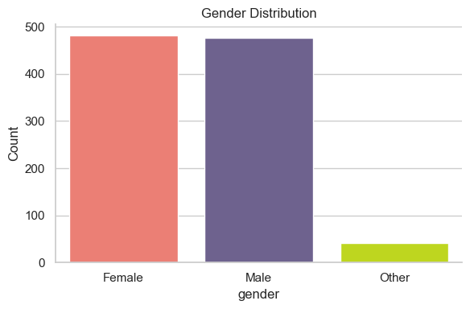
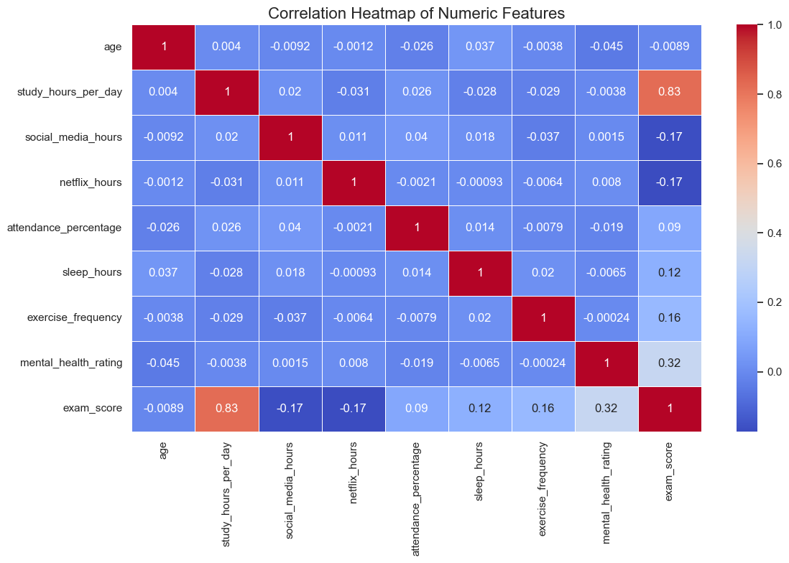
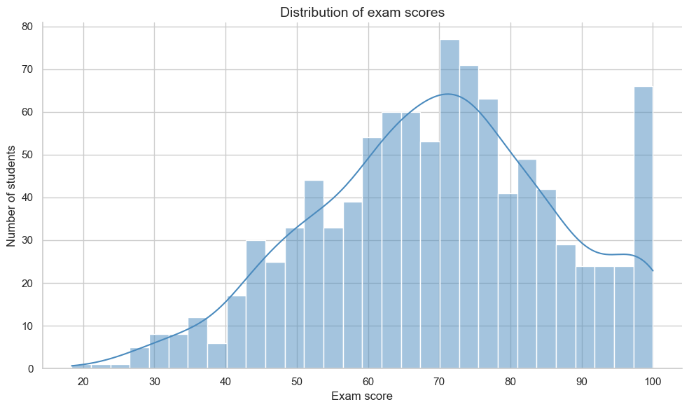
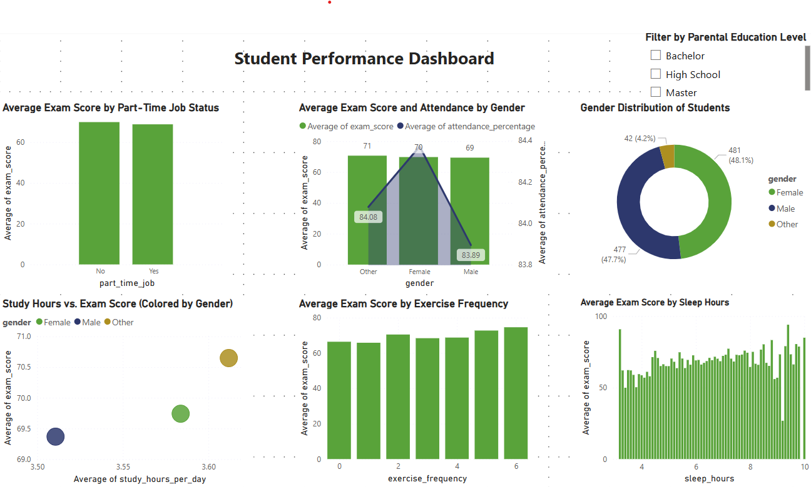

# 🎓 Student Performance Data Analysis

This project explores the relationship between student habits and their exam performance using Python and data visualization tools.

## 📁 Dataset Info

- Source: student_habits_performance.csv
- Rows: 1000 students
- Columns: 16 features (e.g. study hours, social media use, sleep, exam score, etc.)

## 🧹 Steps Performed

1. **Loaded the dataset** using `pandas`.
2. **Checked for missing values** — especially in the `parental_education_level` column.
3. **Filled missing values** using the most common value (mode).
4. **Explored data visually** using seaborn and matplotlib:
   - Gender distribution
   - Exam score distribution
   - Correlation heatmap
   - Study hours vs exam score
   - Gender-wise performance
   - Impact of part-time jobs

5. **Saved cleaned data** into a new CSV for future use.

## 📊 Key Insights

- More study hours generally lead to better exam scores.
- Students without part-time jobs scored slightly higher.
- Gender performance was similar, with some variance.

## 🧰 Tools Used

- Python
- Jupyter Notebook
- pandas, seaborn, matplotlib

---

## 📸 Sample Visualizations

---

## 🚀 How to Run

1. Clone the repo
2. Install dependencies: `pip install pandas matplotlib seaborn`
3. Run the Jupyter Notebook to explore results

